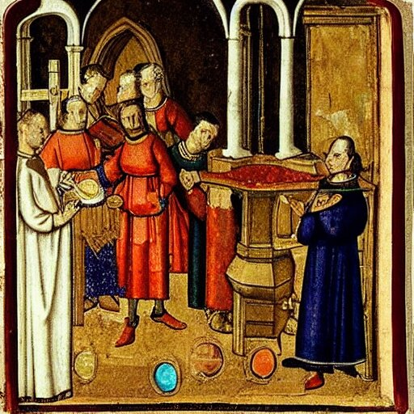

# Le procès de Catherine Quicquat
Fiction interactive réalisée en 2022 dans le cadre du cours de fiction interactive de Isaac Pante (SLI, Lettres, [UNIL](https://www.unil.ch/central/en/home.html)).

### Description
Adapatation libre du procès pour sorcellerie de Catherine Quicquat à Vevey, Suisse (1448).

### Source
Le procès de Catherine Quicquat a été documenté dans *"Folâtrer avec les démons" Sabbat et chasse aux sorciers à Vevey (1448)* par Martine Ostorero (2008).

### Logiciel
Déceloppé sur Twine.

Lien itch.io: https://cluthier.itch.io/catherine
